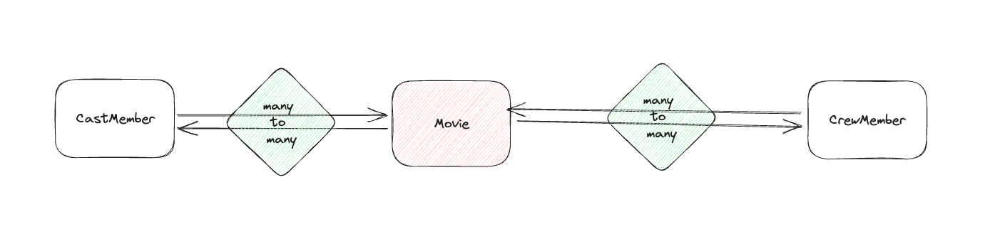

# MoviesApp

This project was generated with [Angular CLI](https://github.com/angular/angular-cli) version 15.2.6.

## Development server

Run `ng serve` for a dev server. Navigate to `http://localhost:4200/`. The application will automatically reload if you change any of the source files.

## Sherlhy Leon Lopez

### Pregunta 1 
Como has visto, la llamada que has implementado para obtener las
películas que están en cartelera puede recibir un parámetro “page”. No es
objeto de esta prueba implementar paginación, pero si tuvieses que
hacerlo, ¿puedes explicar cómo lo harías en la aplicación y en el backend?

##### Respuesta 1
Por la parte del backend recibiría un nuevo query param llamado 'page', con valor por defecto 1, este parámetro 'page' sería propagado por las distintas capas de mi aplicación hasta llegar al servicio que llama a la api externa, seteandolo en el request como un query params. 
Por la parte de la UI, utilizaría alguna componente de paginación como `mat-paginator` de angular material, mantendría una variable `page` en mi componente que me permite conocer la página actual, así como la próxima página a la cual me dirijo, luego escuchando los eventos del template realizaría un nuevo request al backend solicitando la página requerida.

### Pregunta 2
Si tuvieses que manejar un Array con 7 millones de películas, y necesitas
eliminar aquellas en las que el atributo vote_average no supera el valor 6,
¿cómo lo harías? Justifica tu respuesta teniendo en cuenta el rendimiento.

##### Respuesta 2
Lo primero a tener en cuenta es tratar de sacar el array de memoria, en vez, trataría de utilizar recursos de base de datos para poder hacer esta query en la capa de datos en  vez de la capa de aplicación. Esto permite que el procesamiento sea más eficiente sobre todo si agregamos los respectivos índices y construimos queries eficientes dado el servidor de bbdd utilizado. 
De no poder tener este procesamiento del lado de base de datos, un algoritmo lineal O(n) sería lo más eficiente, iterando por cada una de las películas y descartando las que el vote_average no supera el valor 6.

```
const uponAveMovies = movies.filter(movie => movie.vote_average > 6);
```

Luego hay que tener en cuenta que este es un procesamiento pesado, que dada la naturaleza single thread de NodeJS estaría bloqueando nuestro backend, dicho esto, lo más factible posiblemente sea utilizar un servicio externo dedicado a este procesamiento con algún sistema de subscripción/websocket que notifique cuando el procesamiento ha terminado y permita mantener la api disponible. También podríamos pensar en remodelar nuestros datos para evitar que estas consultas sean tan pesadas o implementar alguna especie de filtrado por lotes utlizando demanda perezosa (lazy loading).

## Librerias Utilizadas
[Angular Material](https://material.angular.io/) para estilizar la app.


##Diagrama del modelo de datos de la entidad relación.

